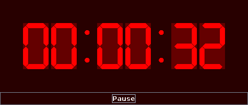

Description
===========

The _GAM UHR_ provides a simple on-going time counter in the style of a
7-segment clock. It is intended to be visible upon a quick glance and hence
shows large segments.

One possible use is keeping track of ongoing game times, hence the prefix _GAM_.
The only interface element provided is a pause button to temporarily halt the
ongoing time counter.

Note: This program does not attempt to achieve maximum precision. In the long
run, it should display time equivalent to the difference between the times
measured by the OS. Internally, it uses `System.currentTimeMillis()` and
absolute times. Changes in OS time may make the clock jump!

Compilation can be performed with `ant jar`.

See also: [tty-clock(1)](https://manpages.debian.org/buster/tty-clock/tty-clock.1.en.html)
